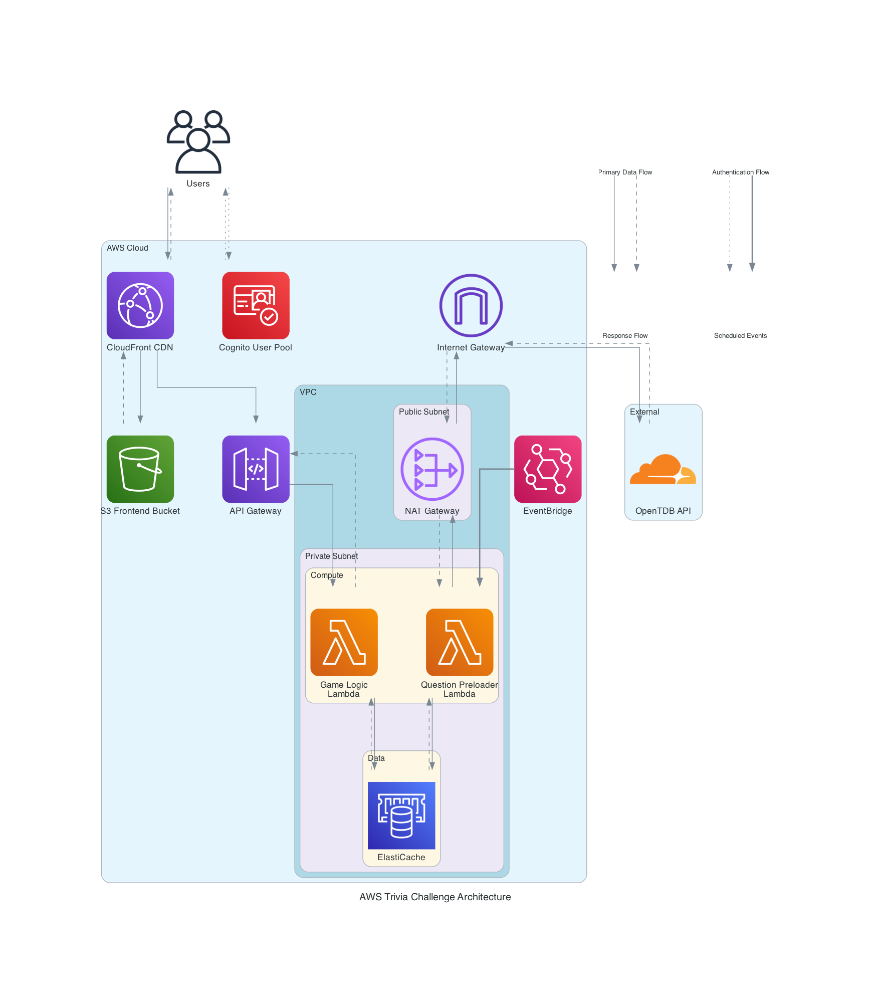

# AWS Trivia Challenge Architecture Description

## Complete Data Flow Architecture

The architecture follows AWS best practices with the following data flows:

**User Interaction Flow**
- Users access the trivia application through CloudFront CDN for global performance
- CloudFront maintains bidirectional connection with S3 for content delivery and caching
- Direct authentication flow: Users ↔ Cognito User Pool (dotted arrows)
- API requests route from CloudFront to API Gateway (AWS managed service)

**Authentication and Processing**
- API Gateway invokes Game Logic Lambda function in private subnet for security
- Bidirectional data flow between Lambda functions and ElastiCache for session management
- All primary data flows shown with solid arrows, responses with dashed arrows

**Scheduled Question Management**
- EventBridge triggers Question Preloader Lambda via scheduled events (bold arrows)
- Question Preloader maintains bidirectional connection with ElastiCache
- Complete external API flow: Preloader → NAT Gateway → Internet Gateway → OpenTDB API
- Response path: OpenTDB → Internet Gateway → NAT Gateway → Preloader Lambda
- HTML entity decoding and data processing before cache storage

**Network Architecture**
- Internet Gateway positioned at VPC boundary (proper AWS placement)
- NAT Gateway in public subnet for outbound internet access
- Lambda functions and ElastiCache isolated in private subnet
- Proper separation of global services (CloudFront, Cognito, S3, API Gateway, EventBridge) from VPC components

## Architectural Components by Layer

**Global Services Layer:**
- **CloudFront CDN**: Global content delivery with bidirectional S3 integration
- **S3 Frontend Bucket**: Static website hosting with CloudFront caching
- **Cognito User Pool**: Direct user authentication service with JWT token management
- **API Gateway**: REST API endpoint management (AWS managed service)
- **EventBridge**: Scheduled event service for automated question preloading

**VPC Network Layer:**
- **Internet Gateway**: VPC boundary component for external connectivity
- **Public Subnet**: Contains NAT Gateway for secure outbound internet access
- **Private Subnet**: Isolated compute and data layer for security
- **NAT Gateway**: High availability outbound internet access for private resources

**Application Layer:**
- **Game Logic Lambda**: Main application logic with bidirectional ElastiCache connection
- **Question Preloader Lambda**: Scheduled background service with complete external API flow
- **ElastiCache Serverless**: In-memory cache with bidirectional Lambda connections

**External Integration:**
- **OpenTDB API**: External trivia source accessed through complete network path

**Visual Flow Indicators:**
- **Solid Lines**: Primary data flows (requests, API calls)
- **Dashed Lines**: Response flows (data returning)
- **Dotted Lines**: Authentication flows (user login/token exchange)
- **Bold Lines**: Scheduled events (EventBridge automated triggers)

## Security Architecture

- **Private Subnets**: Lambda functions and Valkey cache isolated from direct internet access
- **Public Subnets**: NAT Gateway and Internet Gateway for controlled internet connectivity
- **Security Groups**: Network-level firewall rules controlling traffic between components
- **TLS Encryption**: All data in transit encrypted using TLS 1.2+ protocols
- **VPC Isolation**: Complete network separation from other AWS resources
- **IAM Roles**: Least privilege access for Lambda functions and AWS services

## Data Flow Patterns

1. **Complete User Flow**: User ↔ CloudFront ↔ S3 (bidirectional) + CloudFront → API Gateway → Lambda ↔ Response
2. **Direct Authentication Flow**: User ↔ Cognito (global service, dotted arrows) → JWT Validation → Session Management
3. **Bidirectional Caching**: Lambda ↔ ElastiCache (solid/dashed arrows for read/write operations)
4. **Scheduled Question Flow**: EventBridge → Preloader Lambda (bold arrow) → NAT → Internet Gateway → OpenTDB API → Return Path
5. **Network Isolation**: Internet Gateway at VPC boundary → Public Subnet (NAT) → Private Subnet (Lambda/ElastiCache)
6. **Visual Flow Types**: Solid (primary), Dashed (response), Dotted (auth), Bold (scheduled events)